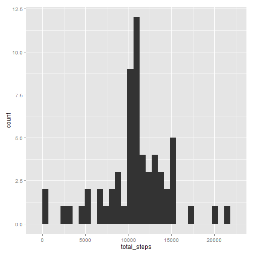

# Reproducible Research -- Week 2 Assignment

This is a combined R code and Markdown document for knitr. This will generate an HTML output.


```r
library( data.table )
library( ggplot2 )
```
## Section A: Loading and preprocessing the data

### Question A.1

```r
df <- read.csv( "repdata-data-activity/activity.csv")
```

### Question A.2
Split the data into two tables, one containing all the steps=NA rows and the other without NA


```r
dt <- data.table( df )  ## use a data table structure for ease of processing

dt_na <- subset(dt, is.na(steps))
dt_notna <- subset(dt, !is.na(steps))
```

## Section B: What is mean total number of steps taken per day?
Now compute the mean and median number of steps per day (where the values are not NA)


```r
d_byday <- dt_notna[, list(total_steps = sum(steps), mean = mean(steps), median = median(steps)), by=date]
```

### Question B.1
Create a histogram of the total number of steps per day.


```r
qplot( total_steps, data=d_byday )
```

```
## stat_bin: binwidth defaulted to range/30. Use 'binwidth = x' to adjust this.
```

 

### Question B.3
Display the total, mean and median steps by day.


```r
d_byday
```

```
##           date total_steps    mean median
##  1: 2012-10-02         126  0.4375      0
##  2: 2012-10-03       11352 39.4167      0
##  3: 2012-10-04       12116 42.0694      0
##  4: 2012-10-05       13294 46.1597      0
##  5: 2012-10-06       15420 53.5417      0
##  6: 2012-10-07       11015 38.2465      0
##  7: 2012-10-09       12811 44.4826      0
##  8: 2012-10-10        9900 34.3750      0
##  9: 2012-10-11       10304 35.7778      0
## 10: 2012-10-12       17382 60.3542      0
## 11: 2012-10-13       12426 43.1458      0
## 12: 2012-10-14       15098 52.4236      0
## 13: 2012-10-15       10139 35.2049      0
## 14: 2012-10-16       15084 52.3750      0
## 15: 2012-10-17       13452 46.7083      0
## 16: 2012-10-18       10056 34.9167      0
## 17: 2012-10-19       11829 41.0729      0
## 18: 2012-10-20       10395 36.0938      0
## 19: 2012-10-21        8821 30.6285      0
## 20: 2012-10-22       13460 46.7361      0
## 21: 2012-10-23        8918 30.9653      0
## 22: 2012-10-24        8355 29.0104      0
## 23: 2012-10-25        2492  8.6528      0
## 24: 2012-10-26        6778 23.5347      0
## 25: 2012-10-27       10119 35.1354      0
## 26: 2012-10-28       11458 39.7847      0
## 27: 2012-10-29        5018 17.4236      0
## 28: 2012-10-30        9819 34.0938      0
## 29: 2012-10-31       15414 53.5208      0
## 30: 2012-11-02       10600 36.8056      0
## 31: 2012-11-03       10571 36.7049      0
## 32: 2012-11-05       10439 36.2465      0
## 33: 2012-11-06        8334 28.9375      0
## 34: 2012-11-07       12883 44.7326      0
## 35: 2012-11-08        3219 11.1771      0
## 36: 2012-11-11       12608 43.7778      0
## 37: 2012-11-12       10765 37.3785      0
## 38: 2012-11-13        7336 25.4722      0
## 39: 2012-11-15          41  0.1424      0
## 40: 2012-11-16        5441 18.8924      0
## 41: 2012-11-17       14339 49.7882      0
## 42: 2012-11-18       15110 52.4653      0
## 43: 2012-11-19        8841 30.6979      0
## 44: 2012-11-20        4472 15.5278      0
## 45: 2012-11-21       12787 44.3993      0
## 46: 2012-11-22       20427 70.9271      0
## 47: 2012-11-23       21194 73.5903      0
## 48: 2012-11-24       14478 50.2708      0
## 49: 2012-11-25       11834 41.0903      0
## 50: 2012-11-26       11162 38.7569      0
## 51: 2012-11-27       13646 47.3819      0
## 52: 2012-11-28       10183 35.3576      0
## 53: 2012-11-29        7047 24.4688      0
##           date total_steps    mean median
```

## Section C: What is the average daily activity pattern?

Similarly, let's calculate the mean/average and maximum number of steps by interval.


```r
d_interval <- dt_notna[, list(interval_mean=mean(steps), interval_max = max(steps)), by=interval]
```
### Question C.1
Let's plot the mean number of steps by interval:

```r
ggplot(d_interval, aes(interval,interval_mean)) + geom_line()
```

 

For fun, let's also plot the max number of steps by interval:

```r
ggplot(d_interval, aes(interval,interval_max)) + geom_line()
```

 

### Question C.2
To answer the question "Which interval, across all days, has the maximum number of steps,
we do the following:

```r
max(d_interval$interval_max)
```

```
## [1] 806
```
##Section D: Imputing missing values

### Question D.1
There are *2304 rows* with NAs.

### Question D.2
We will use the interval mean to fill in the NA values. However, since the mean
is a non-integer, it needs to be converted to an integer before assigning it to
the steps column.


```r
dt_na$steps <- d_interval[ match(dt_na$interval, d_interval$interval), as.integer(interval_mean) ]
```
### Question D.3
Re-combine the two data tables that had been split by NA and not-NA, then order the resultant table
by (date, interval)


```r
dt2 <- dt_na
dt2 <- rbind( dt2, dt_notna )
dt2 <- dt2[order(date,interval),]
```

### Question D.4


```r
d_byday_notna <- dt2[, list(total_steps = sum(steps), mean_steps = mean(steps), median_steps = median(steps)), by=date]

qplot( total_steps, data=d_byday_notna )
```

```
## stat_bin: binwidth defaulted to range/30. Use 'binwidth = x' to adjust this.
```

 


## Section E: Are there differences in activity patterns between weekdays and weekends?

### Question E.1
Add a column "dayofweek" to distinguish between weekdays and weekends.


```r
v <- sapply( dt2$date, function(x) { if (weekdays(as.Date(x), abbreviate=FALSE) %in% c("Saturday","Sunday")) "weekend" else "weekday" })

dt2 <- cbind( dt2, dayofweek = as.factor(v) )
```

### Question E.2


```r
qplot( interval, steps, data=dt2, facets=dayofweek~. )
```

 

